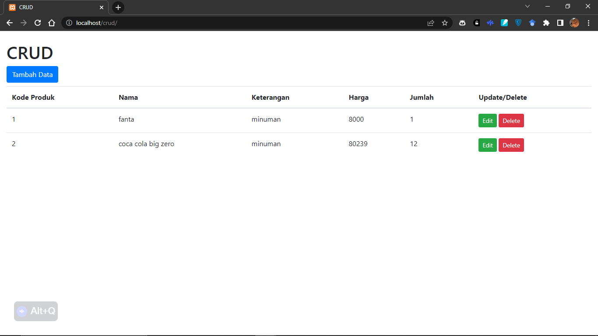
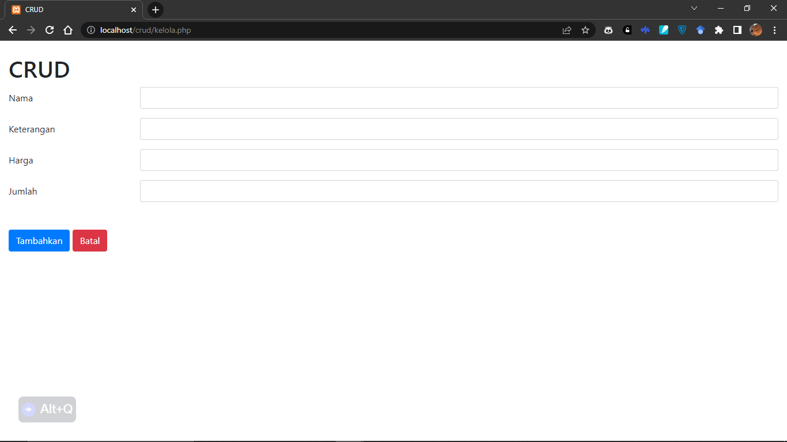
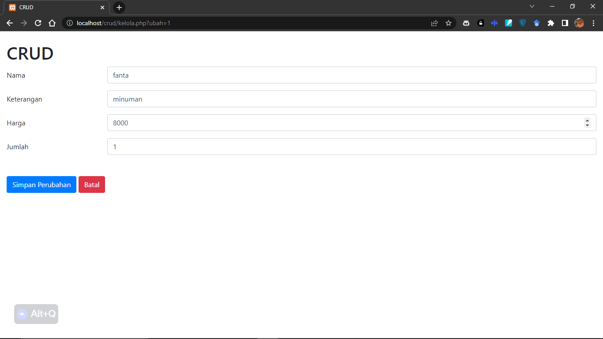
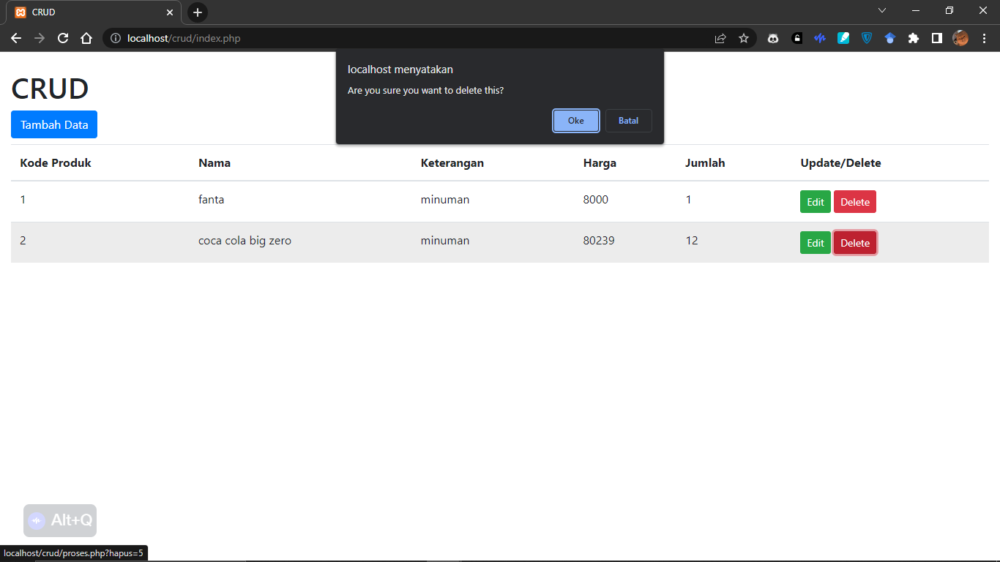

<h1>Tampilan Utama</h1>

Menampilkan seluruh data dari database "pijarcamp" dengan tabel "produk".

<h1>Tampilan Tambah</h1>

Diatas merupakan tampilan ketika akan menambahkan data

<h1>Tampilan Edit</h1>

Di atas merupakan tampilan ketika akan mengedit data, dimana inputan pada tampilan edit sudah diisi berdasarkan data yang akan di edit.

<h1>Tampilan Hapus</h1>

Tampilan ketika tombol hapus ditekan yang akan memunculkan notifikasi atau konfirmasi atas aksi yang dilakukan.

